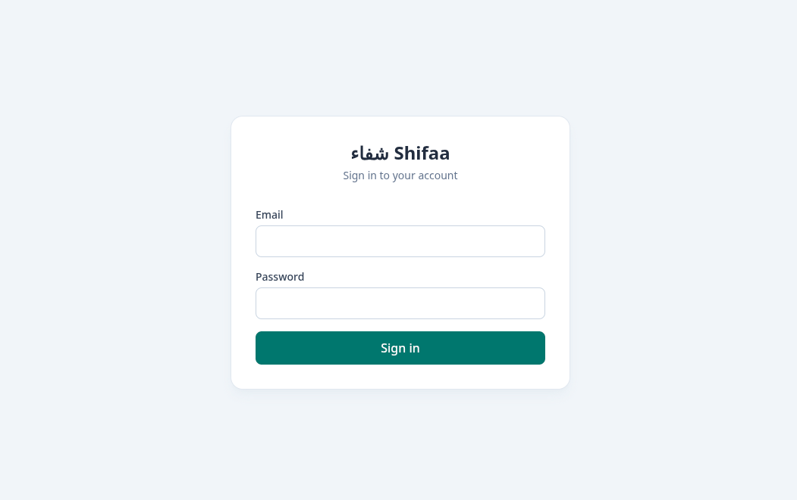
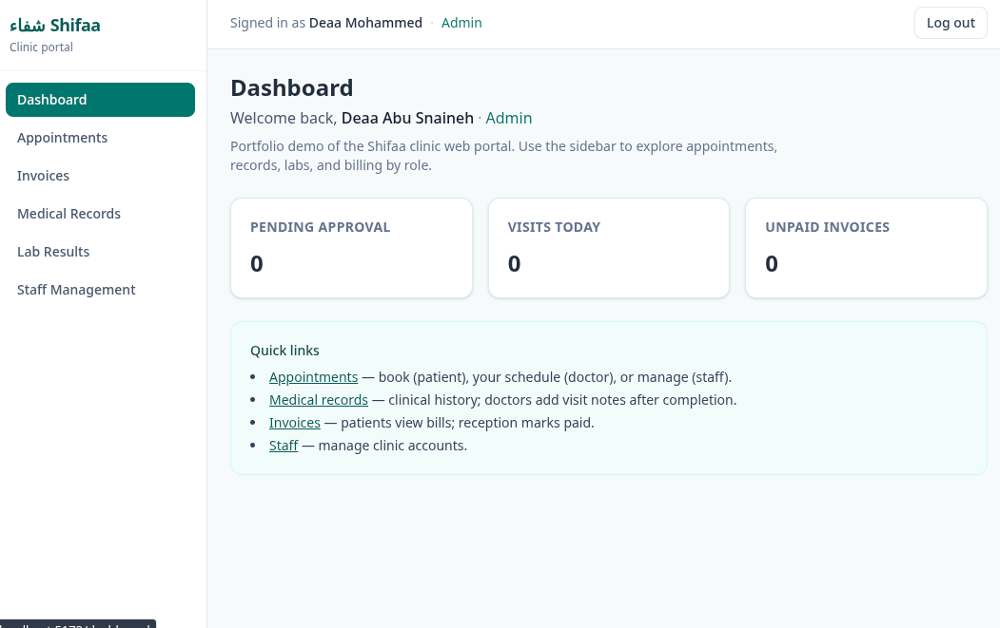
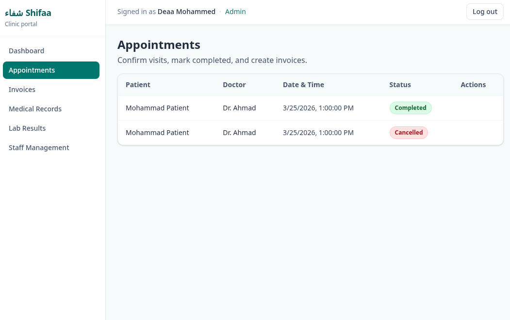
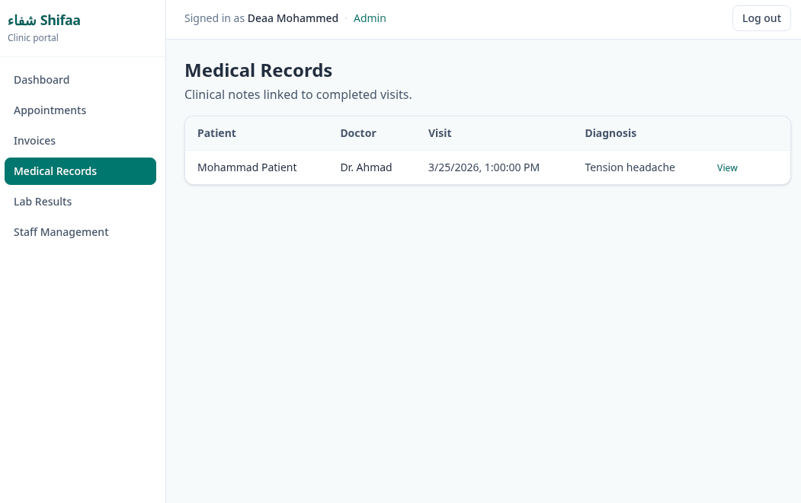
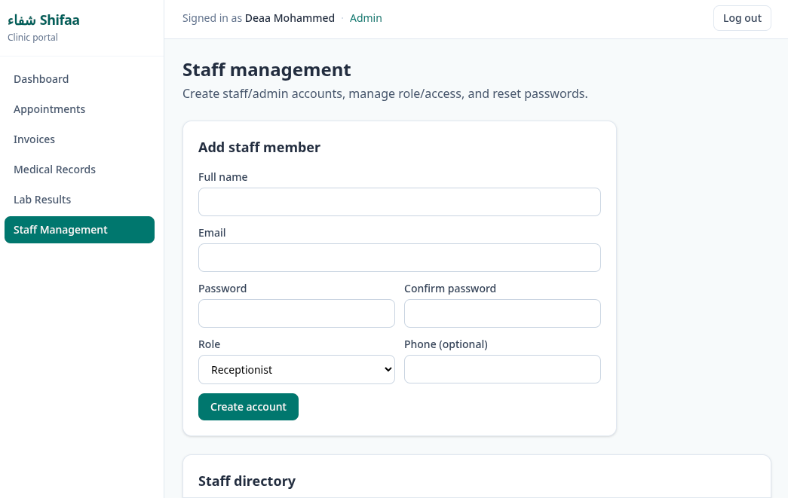

# Shifaa — Clinic Management System

A full-stack clinic management system with a REST API, a web portal, and a Flutter mobile app. Built to cover the core workflows of a small clinic: patient bookings, doctor visit notes, lab results, invoices, and staff administration.

## Screenshots

| Login | Dashboard |
|---|---|
|  |  |

| Appointments | Medical Records |
|---|---|
|  |  |



---

## What's in the repo

| Folder | Stack | Purpose |
|---|---|---|
| `shifaa-api/` | Laravel 11, Sanctum, SQLite | REST API + auth |
| `shifaa-web/` | React 19, Vite, Tailwind CSS | Web portal |
| `shifaa_mobile/` | Flutter, Dio, Provider | Mobile app (Android / iOS) |

---

## Roles

| Role | Can do |
|---|---|
| **Patient** | Book / cancel appointments, view own records, lab results, invoices |
| **Doctor** | View schedule, add/edit visit notes, view lab results |
| **Receptionist** | Confirm / complete / cancel appointments, upload lab results, create & mark invoices paid |
| **Admin** | Everything above + manage staff accounts |

---

## Running locally

### 1. API

```bash
cd shifaa-api
cp .env.example .env
composer install
php artisan key:generate
php artisan migrate --seed   # creates demo accounts
php artisan storage:link
php artisan serve            # http://127.0.0.1:8000
```

Demo accounts created by the seeder:

| Role | Email | Password |
|---|---|---|
| Admin | admin@shifaa.com | password |
| Doctor | doctor@shifaa.com | password |
| Receptionist | receptionist@shifaa.com | password |
| Patient | patient@shifaa.com | password |

### 2. Web

```bash
cd shifaa-web
npm install
npm run dev    # http://localhost:5173
```

To point at a different API host, set `VITE_API_ORIGIN` in a `.env.local` file:

```
VITE_API_ORIGIN=http://your-server.com
```

### 3. Mobile

```bash
cd shifaa_mobile
flutter pub get
flutter run
```

The app defaults to `http://127.0.0.1:8000` on desktop and `http://10.0.2.2:8000` on the Android emulator (which maps to the host machine). For a real device or a deployed API, pass the URL at build time:

```bash
flutter run --dart-define=API_ORIGIN=http://your-server.com
```

---

## API overview

All routes are under `/api` and require a Sanctum Bearer token except `/login` and `/register`.

```
POST   /login
POST   /logout

GET    /doctors
GET    /appointments
POST   /appointments                       # patient
PATCH  /appointments/:id/confirm           # receptionist, admin
PATCH  /appointments/:id/complete          # receptionist, admin
PATCH  /appointments/:id/cancel            # patient, doctor, receptionist, admin
POST   /appointments/:id/medical-records   # doctor

GET    /medical-records
GET    /lab-results
POST   /lab-results                        # doctor, receptionist

GET    /invoices
POST   /appointments/:id/invoices          # receptionist
PATCH  /invoices/:id/mark-paid             # receptionist

GET    /staff                              # admin
POST   /staff                              # admin
PUT    /staff/:id                          # admin
```

---

## Tech notes

- Auth uses Laravel Sanctum (token-based). Tokens are stored in `localStorage` (web) and `SharedPreferences` (mobile).
- File uploads (lab results) are stored via Laravel's `storage/app/public` disk and served through the `/storage` symlink.
- The mobile app uses `Dio` with a request interceptor that attaches the Bearer token and an error interceptor that clears the session on 401.
- Role checks happen in both route middleware (API) and conditionally in the UI — the API is the authoritative gate.
